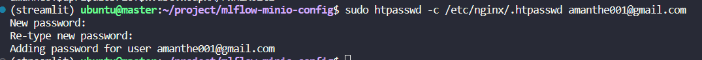

# Setup Mlflow tracking server using MLflow and minio
doc site https://mlflow-minio-config-doc.streamlit.app/

## Step 1: Setup minio server

- Check minio official site for the available packages
    - Browsing for [linux vm](https://min.io/download#/linux)
    - 
- Download the appropriate version, for my case, I used an ubuntu ARM machine
    - I downloaded the file in my software directory with super user privilage
        ```sh
        cd ~/software
        wget https://dl.min.io/server/minio/release/linux-arm64/minio_20230930070229.0.0_arm64.deb
        ```
    - Then installed it in my machine
        ```
        dpkg -i minio_20230930070229.0.0_arm64.deb
        ```
- Test the minio storage
    - Check if its running properly or not, exposing the /mnt/data directory
        ```
        MINIO_ROOT_USER=admin MINIO_ROOT_PASSWORD=password minio server /mnt/data --console-address ":9001"
        ```
    - Configure nginx server for my site `minio.mlhub.in` port 80
        ```sh
        server {
            server_name minio.mlhub.in;
            #server_name 140.238.227.112;
            location / {
                proxy_pass http://localhost:9001/;
                proxy_set_header Host $host;
                proxy_set_header Upgrade $http_upgrade;
                proxy_set_header Connection upgrade;
                proxy_set_header Accept-Encoding gzip;
                # pass max_body_size 1024M; 0 for unlimited
                client_max_body_size 0;
            }
            listen 80;
            listen [::]:80;
        }
        ```
    - Run the minio and check the browser
        ```
        MINIO_ROOT_USER=admin MINIO_ROOT_PASSWORD=password minio server /mnt/data --console-address ":9001"
        ```
        

- Once installed, we can start the minio server using systemctl/service command
    - Upon checking status before starting the minio server
        ```sh
        sudo systemctl status minio
        # OR
        sudo service minio status
        ```
        
- Create minio user and group
    - Create group minio-user
        ```
        sudo groupadd -r minio-user
        sudo useradd -M -r -g minio-user minio-user
        ```
    - Create the directory if not available and give minio-user ownership
        ```
        sudo mkdir /mnt/data
        sudo chown minio-user:minio-user /min/data
        ```
    - Setup Minio environment and provide ssl certificate directory, username and password
        - We are yet to set the certs directory, will do it later
        ```
        MINIO_VOLUMES="/mnt/data"
        MINIO_OPTS="--certs-dir /home/ubuntu/.minio/certs --console-address :9001"
        MINIO_ROOT_USER=username
        MINIO_ROOT_PASSWORD=password
        ```
- Setup firewall (optional, Required for specific vm)
    - Install firewall and give public access to port 9000 and 9001
        ```sh
        sudo apt install firewalld
        sudo firewall-cmd --zone=public --permanent --add-port=80/tcp
        sudo firewall-cmd --zone=public --permanent --add-port=9000/tcp
        sudo firewall-cmd --zone=public --permanent --add-port=9001/tcp
        sudo firewall-cmd --reload
        ```
- Install certgen from official minio github repository
    - Check the site https://github.com/minio/certgen and choose appropriate version
        - In my case I am using ubuntu ARM machine
        
    - Download the package in your software (any prefered) directory and install
        - In my case the url was https://github.com/minio/certgen/releases/download/v1.2.1/certgen_1.2.1_linux_arm64.deb
        ```sh
        cd /home/ubuntu/software
        wget https://github.com/minio/certgen/releases/download/v1.2.1/certgen_1.2.1_linux_arm64.deb
        dpkg -i certgen_1.2.1_linux_arm64.deb        
        ```
- Generate certificate in `/home/ubuntu/.minio/cert` directory
    - I have many subdomains so I will generate an wildcard certificate, applicable to all my sub-domains
        If you want to access using IP address, use ip instead
        ```sh
        sudo certgen -host *.mlhub.in
        ```
    - It will generate 2 files private.key and public.crt, and minio also look for exactly these files
        - Will provide ownership of this two files to minio-user
        ```sh
        sudo chown minio-user:minio-user /home/ubuntu/.minio/certs/private.key
        sudo chown minio-user:minio-user /home/ubuntu/.minio/certs/public.crt
        ```
- Start the minio server
    - Using the systemctl/service command we need to enable and start the minio server
        ```sh
        sudo systemctl enable minio # OR sudo service minio enable 
        sudo systemctl start minio # OR sudo service minio start
        sudo systemctl status minio # OR sudo service minio status
        ```
         

- Expose the site using nginx
    - Looking at the server, we can see 2 ports, One for console exposed to port 9001 and one S3-API exposed to port 9000
    - Need to update the nginx config
        - Added one file minio-server in sites-available i.e. `/etc/nginx/sites-available/minio-server`
        ```sh
        server {
            server_name minio.mlhub.in;
            #server_name 140.238.227.112;
            location / {
                proxy_pass https://127.0.0.1:9001/;
                proxy_set_header Host $host;
                proxy_set_header Upgrade $http_upgrade;
                proxy_set_header Connection upgrade;
                proxy_set_header Accept-Encoding gzip;
                client_max_body_size 0;
            }
            listen 80;
            listen [::]:80;
        }
        server {
            server_name s3.mlhub.in;
            #server_name 140.238.227.112;
            location / {
                proxy_pass https://127.0.0.1:9000/;
                proxy_set_header Host $host;
                proxy_set_header Upgrade $http_upgrade;
                proxy_set_header Connection upgrade;
                proxy_set_header Accept-Encoding gzip;
                client_max_body_size 0;
            }
            listen 80;
            listen [::]:80;
        }
        ```
        - Above first server configuration is for minio console and second is for the S3-API
    - Create a symbolic link of our configuration file in sites-enabled directory
        ```sh
        sudo ln -s /etc/nginx/sites-available/minio-server /etc/nginx/sites-enabled/
        ```
    - Restart the nginx server using systemctl/service
        ```sh
        sudo service nginx restart
        # OR
        sudo systemctl restart nginx
        ```

- Get the ssl certificate using certbot/letsencrypt
    - Give it a try, running `certbot`
    - It will ask you for the subdomains in a list
    - Choose one and repeat for others

- Test if the S3-API is working or not
    - Lets open our minio site (in my case https://minio.mlhub.in)
    - Generate new Access key (id and secret)
    
    - Create bicket and upload some files
    - Open notebook and check for the file through boto3
    

## Step 2: Setup mlflow server

- Create a virtual environment, in my case I created a virtual environment with name mlflow in my directory /home/ubuntu/.virtualenvs/
- Install essential packages in the virtual environment
    ```sh
    pip install mlflow boto3
    ```
- Run mlflow locally with minio credentials
    ```sh
    export MLFLOW_S3_ENDPOINT_URL=https://s3.mlhub.in
    export AWS_ACCESS_KEY_ID=xxxxxxxxxxxxxxxxxxxxxxxxxx
    export AWS_SECRET_ACCESS_KEY=xxxxxxxxxxxxxxxxxxxxxxxxxxxxxxxxxxxxxx
    # Then run 
    mlflow server --backend-store-uri sqlite:////home/ubuntu/ml-tracking-server/mlhub.mlflow.sqlite \
                  --default-artifact-root s3://private/ml-tracking-server/mlhub-artifacts -p 5000
    ```
- Add basic authentication for your mlflow site
    - Install apache2-utils
    ```sh
    sudo apt install apache2-utils
    ```
    - Add user and store it in file /etc/nginx/.htpasswd, suppose my username is mu email id
    ```sh
    sudo htpasswd -c /etc/nginx/.htpasswd amanthe001@gmail.com
    ```
    - It will prompt for **New password** and **Re-type new password**, after filling both, new user will be added
    
- Expose the port using nginx
    - Create a new config file, I created /etc/nginx/sites-available/mlflow-server
    - in my mlflow-server config file I have added `auth_basic_user_file /etc/nginx/.htpasswd;` to enable Basic auth  
    ```sh
    server {
    server_name mlflow.mlhub.in;
    #server_name 140.238.227.112;
    location / {
        proxy_pass http://localhost:5000/;
	    auth_basic "Administrator’s Area";
        auth_basic_user_file /etc/nginx/.htpasswd;
        proxy_set_header Host $host;
        proxy_set_header Upgrade $http_upgrade;
        proxy_set_header Connection upgrade;
        proxy_set_header Accept-Encoding gzip;
        }
    listen 80;
    listen [::]:80;
    }
    ```

- Check for the website and perform some basic mlflow tracking operation e.g. upload dataset, text file
    ```py
    import os
    os.environ["MLFLOW_S3_ENDPOINT_URL"] = "https://s3.mlhub.in"
    os.environ["AWS_ACCESS_KEY_ID"]="xxxxxxxxxxxxxxxx"
    os.environ["AWS_SECRET_ACCESS_KEY"]="xxxxxxxxxxxxxxxxxxxxxxxxxxxxxxxxxxxxxxx"
    os.environ['MLFLOW_TRACKING_USERNAME'] = 'amanthe001@gmail.com'
    os.environ['MLFLOW_TRACKING_PASSWORD'] = 'xxxxxxxxxxx'
    import mlflow
    import pandas as pd

    mlflow.set_tracking_uri('https://mlflow.mlhub.in')

    df = pd.read_csv("http://archive.ics.uci.edu/ml/machine-learning-databases/wine-quality/winequality-red.csv",sep=";")
    with mlflow.start_run(run_id = run_id,experiment_id=0) as run:
        run_id = run.info.run_id
        mlflow.log_table(data=df.to_dict(),artifact_file="data.json")
        mlflow.log_text("Checking artifacts",artifact_file="sample.txt")
        mlflow.log_metric(key="metric1",value=5)
    
    ```
    <!--  -->
    - Need to pass all env variables before importing the package 
    
    - Verify run in mlflow UI
    
    - Verify the presence of logged metrics, artifact iin mlflow run 
    